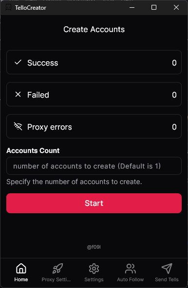

# TelloCreator

TelloCreator is a fast and simple tool to create Tellonym accounts, make them follow a target account, and send tells. It features a clean UI, proxy support, optimized performance, and a seamless flow for sending anonymous messages.

## Features

- Create multiple Tellonym accounts quickly.
- Use accounts to follow a target Tellonym username.
- Send anonymous tells to target accounts.
- Simple and clean UI for easy usage.
- Requires proxies to avoid blocks.
- Optimized for speed and efficiency.
